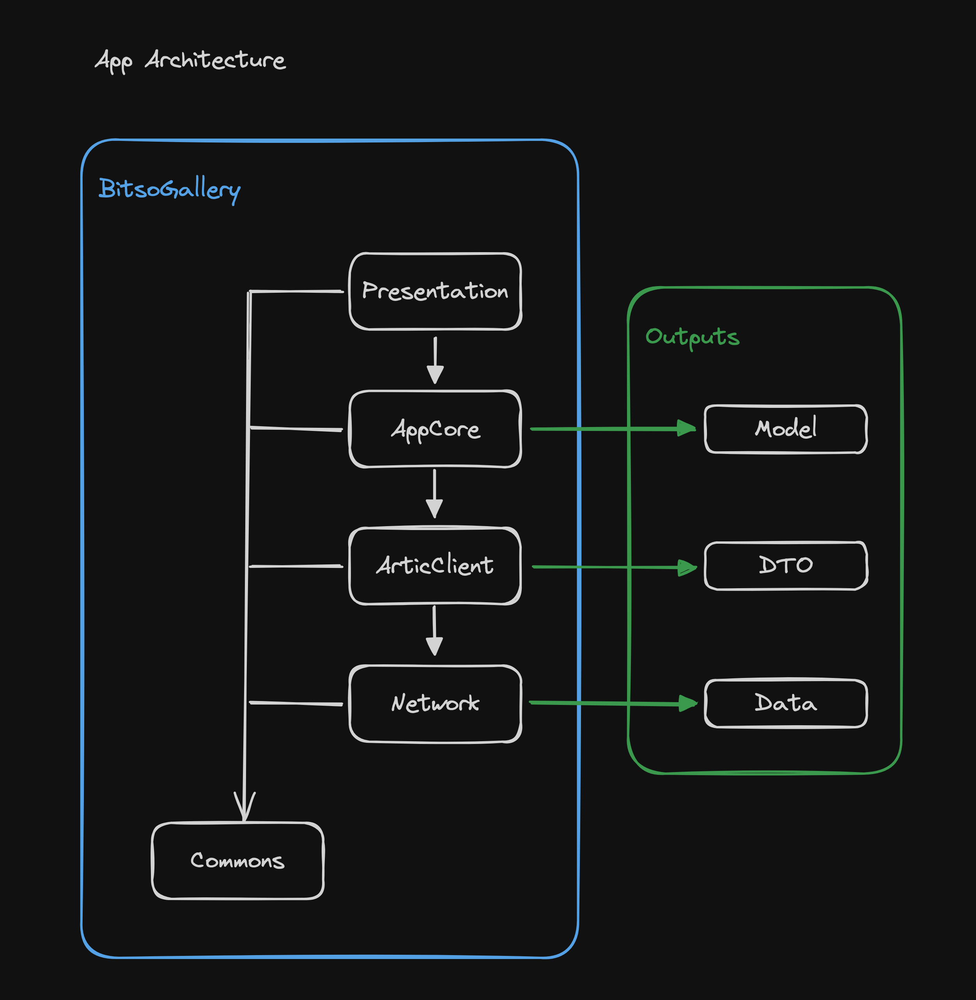

# Running

The app only depends on SPM so it should build and run out of the box. Probably need to adjust signing team.

Please use the project workspace for running and testing.

# Testing

I created a test plan for all unit tests, did the same for UI Tests but didn't have time to write them.

The unit tests test plan is the default plan for the main app so just running the tests with its scheme selected works.

# App Architecture



## Commons

This module is not supposed to be dependent on anything else.

It should be a place to share common objects like the log function and Loggable protocol that can be used in all other modules.

The Protocols like JSONDecoderProtocol and JSONEncoderProtocol are to facilitate dependency injection in various places of the app.

Only simple stuff.

## Network

A very basic and naive network layer only doing what is needed for this app which is get calls.

Does not handle headers, auth challenges, or other HTTP methods that not GET.

Only returns raw Data or throws errors, does not make any kind of type conversion/decoding.

## ArticClient

Responsible for the specifics of the Artic API.

Depends on Network to make the calls.

Knows about the API endpoints and specific query parameters.

If we were to support other APIs for similar data and aggregate to show in the same list, I would have created another module to handle all the API modules and coordinate the calls and response.

ArticClient knows about the expected backend response from this API, those are the DTO objects.

If in the future anything changes in those responses we can change locally and just fix the mapper to the business object. This would also allow us to support multiple APIs with different responses but having a unique business object.

## AppCore

I should think of a better name and change this.

Basically this is where the more complex stuff happens.

AppCore defines a Repository object that contains the repositories needed to all a known business models. If in the future those would grow, it would be possible to separate into multiple repository aggregators per flow/context.

Those repositories receive calls to return the business objects, check if they are available in cache, return the cached version if it exists, if not, fetch from the network and once successfully fetched it stores in cache for future use.

It depends on a external module `Cache`. I could have done it manually with NSCache but for this test and real applications its nicer to use a dependency like this take already handles for example when the system emits a warning about memory usage.

## Presentation

This is where the views and coordinators are created.

There is a dependency on swift-collections, not needed, could have handled very easily the api returning repeated artworks in different pages but felt cleaner with Apples OrderedSet. Guess it's a nice dependency.

If we call each app screen a `Scene`, we have the Artwork scene and the Artist Details scene.

Those are defined as enuns that contain `Actions`, a `DataModel`, possibly another enum with view states, the `Coordinator` and the `ContentView`.

`ViewCoordinators` can call other `ViewCoordinators` and be composable.
Check how `ContentCoordinator` handles the coordinators for Artwork and Artist.

Some explanation of how the Coordinator/Scenes work. Naming is something I'm still working on.

```swift

enum SampleScene {}

extension SampleScene {
    // I usually make those CustomStringCovertible for logging convinience.
    enum Actions {
        case loadData
    }
}

extension SampleScene {
    // Optional, I like to use.
    // I usually make those CustomStringCovertible for logging convinience.
    enum ViewState: Equatable {
        case initial
        case loaded([MyModel])
    }
}

extension SampleScene {
    final class DataModel: ObservableObject {
        // If there is a ViewState
        @Published var viewState: ViewState
        
        // The model to be displayed. Even if the view state has the model as associated
        // value, I like to store it separated so I can still show data if my view state 
        // chances to refresh for example but I want to swap the data for the new one
        // only after the new succeeds.
        @Published var myModel: [MyModel] = []
    }
}

extension SampleScene {
    // This acts like the Coordinator on UIKit MVC.
    // I use the `ViewCoordinator` protocol to facilitate mocking and testing.
    // Contains a weak reference to data model so the views can observe it.
    // Should contain other dependencies like the repository.
    final class Coordinator: ObservableObject, ViewCoordinator {
        private var dataModel: DataModel
        private weak var repository: RepositoryProtocol
        
        // Satisfies the `ViewCoordinator` protocol.
        // It's where the CoordinatorView is created.
        @ViewBuilder
        public var contentView: some View {
            // Sample...
            ContentView(
                dataModel: self.dataModel,
                actionHandler: self.perform(action:)
            )
            .navigationTitle("Artworks")
        }
        
        // Satisfies the `ViewCoordinator` protocol.
        // This will serve as action handler for the `ContentView` so the view can
        // perform for examplo a loadData action without having any dependency or
        // knowledge of how it is loaded.
        @MainActor
        public func perform(action: Actions) async throws {
            switch action {
            case .loadData:
                let myModel = try await repository.loadData()
                self.dataModel.viewState = .loaded(myModel)
            }
        }
    }
}

extension SampleScene {
    // Finally the `ContentView` which is the actual View if we were talking about MVC.
    // Views here can react on dataModel changes and perform `Actions` previously defined.
    struct ContentView: View {
        typealias ActionHandler = (Actions) async throws -> Void
        
        @ObservedObject var dataModel: DataModel
        private let actionHandler: ActionHandler
        
        init(
            dataModel: DataModel,
            actionHandler: @escaping ActionHandler
        ) {
            self.dataModel = dataModel
            self.actionHandler = actionHandler
        }
        
        var body: some View {
            someViewHere...
        }
    }
}
```

## BitsoGallery App

The app itself is very simple. The idea is to have it build itself mostly from the presentation module.

`BitsoGalleryApp` has a dependency `Application`. This is the object responsible to hold our dependencies at the moment. If it would grow we would have more.

`Application` has an instance of `ContentCoordinator` that is responsible to define what flows the app will display. It holds an instance of repository so that it can inject it in the `ContentCoordinator` and this will be used in other parts of the app.

I left a sample `AppState` enum just to demo how the app state could be changed depending on many factors like user being authenticated or not, some deep link that needs to open another flow, those things. It's not really being used but nice to see that there is this flexibility with this approach. 


## Notes

I'm testing this private/public folder separation the the modules because I think it makes it easier to realize that something should be private when we see it in the private folder. You know, sometimes things move around and we forget to update the access level. Just a visual clue.

Things I did not do:
- Image Cache. (time constraint)
- Previews... sorry, updated a lot of stuff and didn't have time to go back to fix them.
- Would have added more unit tests for the presentation layer, UITests and snapshots.
- Overall cleanup and document methods that are missing documentation.
